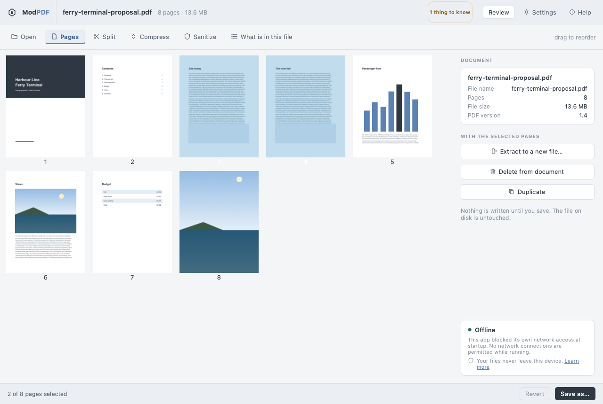
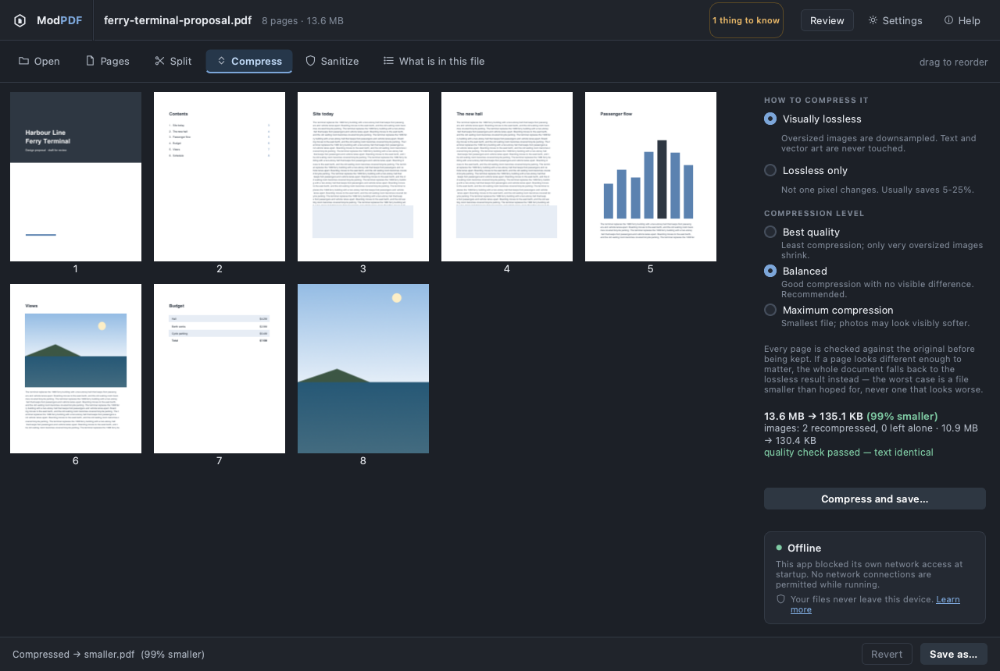

# ModPDF

[](https://github.com/BryanIGD/ModPDF/actions/workflows/test.yml)

Split, merge, reorder and compress PDFs on your own computer. ModPDF is a
desktop app and a command-line tool. It never uploads your files, and it goes
further than promising that: when it starts, it turns off its own ability to
connect to the network. The test suite checks that.



## Why I built this

Search for "split PDF" and almost every result is a website. You upload your
file, their server does the work, and you download the result. That's fine for
a restaurant menu. It's not fine for a signed contract, a bank statement or a
medical record, and most people never think about where that file just went.

I wanted a tool I could trust with those documents. Everything in ModPDF runs
locally, and I wanted that to be something you can verify instead of something
you have to take my word for.

## What it does

- **Page editing:** split, merge, reorder, delete, duplicate and extract pages.
- **Compression:** it checks every page against the original before keeping
  the result.
- **Inspect:** shows what's in a PDF that you can't see on the page, like
  scripts, attachments and earlier revisions of the text.
- **Sanitize:** removes all of that and writes a clean copy.
- **Both interfaces share one codebase.** The desktop app and the command line
  call the same functions, so a fix reaches both.

## Install

Needs Python 3.11 or newer.

```
pipx install "modpdf[gui]"    # command line and desktop app
pipx install modpdf           # command line only
```

Then run `modpdf --help`, or `modpdf-gui` for the app.

**The Mac app:** download `ModPDF-…-macos-arm64.zip` from the
[latest release](https://github.com/BryanIGD/ModPDF/releases/latest). It's
built for Apple Silicon Macs. On an Intel Mac, use pipx above, or build the
app yourself with [packaging/macos](packaging/macos/README.md). The app isn't
signed yet, so macOS blocks it the first time you open it. To allow it, go to
System Settings → Privacy & Security and click Open Anyway.

## The desktop app



Open a PDF and its pages show up as thumbnails. You can select them, drag them
into a new order, delete, duplicate, extract, split, compress or sanitize.
Nothing is written until you save. The app keeps your edits as a new order of
the original pages instead of a modified copy, so Revert is instant.

Opening a second file adds its pages after the first one's, so you can build
one document out of several. Dropping several files onto the window at once
merges them straight into a new file.

The header shows a chip when a file contains something worth knowing about,
like the "1 thing to know" above. In that file it's the metadata, which names
the author and the software that made it. For a file with JavaScript in it,
the chip turns red.

Settings has three options, and each applies as soon as you change it:
thumbnail size, the compression level the Compress panel starts on, and light
or dark. Those three settings are the only thing the app remembers between
runs. There is no recent-files list, and thumbnails are never saved to disk,
because both would leave a record of which confidential files you opened.

## The command line

Every example here is real output.

```
$ modpdf split report.pdf --pages 1-10,11-20,21- -o chapters/
23 pages → 3 files in chapters
  report-p001-010.pdf  10 pages
  report-p011-020.pdf  10 pages
  report-p021-023.pdf  3 pages
```

```
$ modpdf merge report.pdf appendix.pdf -o complete.pdf
2 files (23 + 4 pages) → complete.pdf 27 pages
```

`reorder` keeps exactly the pages you list, in that order. If you leave a page
out, it tells you:

```
$ modpdf reorder report.pdf --order -1,1-3 -o summary.pdf
23 pages → summary.pdf 4 pages (19 pages dropped)
```

Page numbers work like a print dialog: they start at 1, ranges include both
ends, `12-` means page 12 to the end, and `-1` is the last page. `--dry-run`
shows what would be written without writing anything.

`inspect` shows what's in a file besides its pages. It doesn't change anything.

```
$ modpdf inspect statement.pdf
statement.pdf
  3 pages · 3.1 KB · PDF 1.3 · not encrypted

  8 things worth knowing:

  JavaScript — 1 script entry
    PDF JavaScript can run when the file is opened. It is the most common
    way a PDF is used to attack the person reading it.
  Opens automatically — an /OpenAction is set
    Something is set to happen the moment the document is opened, without
    the reader choosing it.
  Launch action — 1 occurrence
    asks your PDF reader to run a program on your computer
  Embedded files — 1: payroll.xlsx
    Whole files are bundled inside this PDF and travel with it. They do not
    appear on any page.
  ...
```

It also finds earlier revisions. A lot of editors save by adding changes to
the end of the file, so text you deleted can still be recovered from it.
`--json` gives the same report in a form scripts can read.

`sanitize` removes all of it:

```
$ modpdf sanitize statement.pdf -o safe.pdf
safe.pdf 3 pages
  removed: JavaScript (1), automatic open action, Launch actions (1),
  embedded files (1), XFA form, metadata
  Pages and text are unchanged. This is not redaction:
  anything visible on a page is still there.
```

It rebuilds the document from its pages instead of deleting references,
because an unlinked script is still sitting in the file. There's a test that
searches the output's bytes to prove the payload is gone.

`compress` checks its own work:

```
$ modpdf compress deposition.pdf -o smaller.pdf
smaller.pdf  55.1 KB → 6.0 KB  (89% smaller)
  images     1 recompressed, 0 left alone   45.3 KB → 4.7 KB
  quality    text identical · largest visible difference 2.0% of one page   PASS
```

Before keeping the result, it renders every page of both files and compares
them. If any page looks different enough to matter, it throws the result away,
uses a lossless version instead, and tells you. The worst case is a file that
didn't shrink as much as you hoped, never one that looks worse.

A PDF that's mostly text won't get much smaller, and `compress` says so rather
than making up savings. The big reductions come from scanned images.
`--level low|balanced|high` sets how hard it tries, and `--lossless` never
changes a single pixel. [How compression works](docs/compression.md) has the
details, including which images it deliberately leaves alone and why.

## How the privacy claim is enforced

- **No network.** At startup, before reading any file, ModPDF replaces
  Python's socket, DNS and TLS entry points with ones that refuse.
  `tests/security/` checks that network calls fail and that PDF work still
  succeeds while they're blocked. CI then runs the whole suite a second time
  inside a network namespace with no network interfaces at all.
- **No passwords in the command line.** There's no `--password VALUE` flag,
  because other programs can read a command's arguments and they end up in
  your shell history. Use `--password-stdin` or `MODPDF_PASSWORD`.
- **No half-written files.** Output is written next to its destination and
  moved into place in one step, readable only by you (mode `0600`).
- **Sync folders are flagged.** If you save into iCloud Drive, Dropbox, Google
  Drive or OneDrive, it warns you, because that file is about to be uploaded.
- **Bad input fails safely.** Malformed, truncated, empty and oversized files
  get a clear error and no partial output. A damaged file that QPDF can repair
  still opens, with a warning that content may be missing.

[THREAT_MODEL.md](THREAT_MODEL.md) lists what this protects against and, just
as important, what it doesn't.

## How it's built

```
src/modpdf/
  cli.py        command line (Typer)
  gui/          desktop app (PySide6)
  tasks.py      every operation, called by both interfaces
  ops/          split, merge, reorder, compress, sanitize
  verify.py     the compression quality check
  security/     network guard, safe file writing, input limits, passwords
```

The PDF parsing itself is done by QPDF (through pikepdf) and PDFium (through
pypdfium2). I didn't write a PDF parser, and I don't think I should have. The
reasons for the main decisions are written up in [docs/adr](docs/adr):

- [Python, not Go or Rust](docs/adr/0001-python-over-go-and-rust.md)
- [pypdfium2, not PyMuPDF](docs/adr/0002-pypdfium2-over-pymupdf.md)
- [pikepdf, not Ghostscript](docs/adr/0003-pikepdf-over-ghostscript.md)
- [Checking every compressed page](docs/adr/0004-compression-quality-gate.md)
- [Blocking the network at runtime](docs/adr/0005-no-network-at-runtime.md)
- [One lock for PDFium](docs/adr/0006-one-lock-for-pdfium.md)

## Problems I ran into

A few bugs that taught me something:

- **Qt's drag-and-drop deleted pages.** Qt's built-in move is a remove
  followed by an insert. Dropping page 3 between pages 5 and 6 destroyed page
  6 and left two copies of page 3. I replaced it with plain mouse tracking,
  which also made reordering testable (`gui/grid.py`).
- **A background job that disappeared.** Adding a second file starts a job
  from inside another job's completion callback. Nothing kept the first job's
  Python object alive, so it was sometimes garbage collected before its result
  arrived, and the window said "Adding…" forever with no error.
- **Thumbnails froze the window.** The renderer was moved to a worker thread
  but called directly from the window. A direct call runs on the caller's
  thread, so every page rendered on the UI thread anyway.
- **Fixing that crashed the tests.** PDFium isn't thread-safe, even across
  different documents. Once thumbnails really rendered in the background, two
  threads could be inside it at once. Every PDFium call now goes through one
  lock.
- **CMYK images turned white.** When I tried re-encoding CMYK images, the
  quality check caught a pure cyan swatch rendering as white. It's a known
  problem with Adobe's CMYK JPEGs, so CMYK images are now left alone.

## What it will not do

- **Redaction.** Drawing a black box over text leaves the text in the file,
  and that has leaked real documents more than once. I'd rather not ship it
  than ship it wrong.
- **Big savings on text-only PDFs.** They're already compressed. Expect 5–25%.
- **Protect you from a compromised computer.** If something already controls
  your machine, nothing here helps.

## Not built yet

Running each job in its own process with a timeout. A timeout that can't
interrupt work already running inside a native library wouldn't actually fire,
so there isn't one until the work runs in a separate process. Also JBIG2, font
subsetting, and resizing images that have a transparency mask.

## Development

```
git clone https://github.com/BryanIGD/ModPDF.git
cd ModPDF
uv sync --all-groups
uv run pytest
```

On every pull request, CI runs ruff, mypy (strict) and the tests on macOS,
Linux and Windows, plus pip-audit and bandit. Every PDF the tests use is
generated at test time, and no real document is ever committed.

See [CONTRIBUTING.md](CONTRIBUTING.md) for how the code is organised and
tested. Found a security issue? Please follow [SECURITY.md](SECURITY.md)
instead of opening a public issue.

## License

Apache 2.0. See [LICENSE](LICENSE), and [NOTICE](NOTICE) for the libraries
ModPDF depends on.
